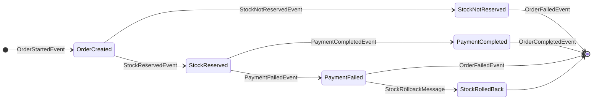

---

# 🚀 Microservices - Saga Pattern (Orchestration)

This project demonstrates an **orchestration-based Saga Pattern** implementation using **MassTransit** and **RabbitMQ** to ensure transactional consistency across multiple microservices.
The architecture revolves around an order processing flow involving three core services: **OrderAPI**, **StockAPI**, and **PaymentAPI**.

---

## 🎯 Project Goal

The goal is to **reliably manage a complex business process**—from order creation to payment completion—as a **distributed transaction** across multiple services.
It uses **compensation (rollback)** mechanisms to maintain system integrity in case of failures.

---

## 🏗️ Architecture

The system consists of multiple **loosely coupled microservices** communicating asynchronously via **RabbitMQ**.

* **Orchestration:** `SagaStateMachineService` acts as the central orchestrator (state machine) managing the order lifecycle.
* **Communication:** Services exchange events and commands. The `Shared` library contains all message contracts and RabbitMQ queue names.

---

## 📊 Saga State Machine Diagram

---

### Flow Description

1. **OrderStartedEvent** from `OrderAPI` starts the saga → State changes to **OrderCreated**.
2. Orchestrator sends a stock reservation request to `StockAPI`.
3. If stock is available → **StockReserved**; if not → **StockNotReserved** and saga ends (failed).
4. When stock is reserved, a payment request is sent to `PaymentAPI`.
5. If payment succeeds → **PaymentCompleted** → Saga ends successfully.
   If payment fails → **PaymentFailed** → Sends `StockRollbackMessage` to revert stock → Saga ends (failed).

---

## 📂 Project Structure

### **`SagaStateMachineService`**

* **Purpose:** Central orchestrator handling distributed transactions.
* **DB:** MSSQL for saga persistence.
* **Main Files:**

  * `OrderStateMachine.cs` → State transitions
  * `OrderStateInstance.cs` → Saga instance data
  * `OrderStateMap.cs` → DB mapping

### **`OrderAPI`**

* **Purpose:** REST API to create/manage orders.
* **DB:** MSSQL
* **Main Files:**

  * `OrderCompletedEventConsumer.cs`
  * `OrderFailedEventConsumer.cs`
  * `OrderAPIDbContext.cs`

### **`StockAPI`**

* **Purpose:** Manages product inventory.
* **DB:** MongoDB
* **Main Files:**

  * `OrderCreatedEventConsumer.cs`
  * `StockRollbackMessageConsumer.cs`
  * `MongoDbService.cs`

### **`PaymentAPI`**

* **Purpose:** Handles payment simulation.
* **Main Files:**

  * `PaymentStartedEventConsumer.cs`

### **`Shared`**

* **Purpose:** Common contracts & settings.
* **Main Files:**

  * Event definitions
  * Command definitions
  * `RabbitMQSettings.cs`

---

## ⚙️ Setup & Run

1. Start **RabbitMQ**, **MSSQL**, and **MongoDB**.
2. Update connection strings in `appsettings.json`.
3. Run DB migrations in `SagaStateMachineService`.
4. Start services in order:

   1. `SagaStateMachineService`
   2. `OrderAPI`
   3. `StockAPI`
   4. `PaymentAPI`
5. Use `OrderAPI` endpoints to create orders and trigger the saga flow.

---
